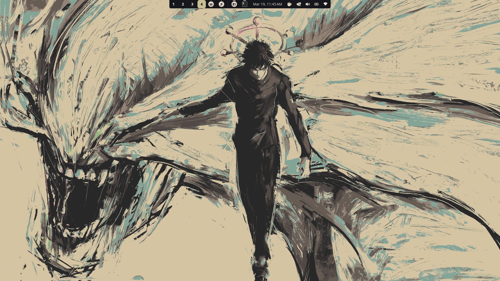
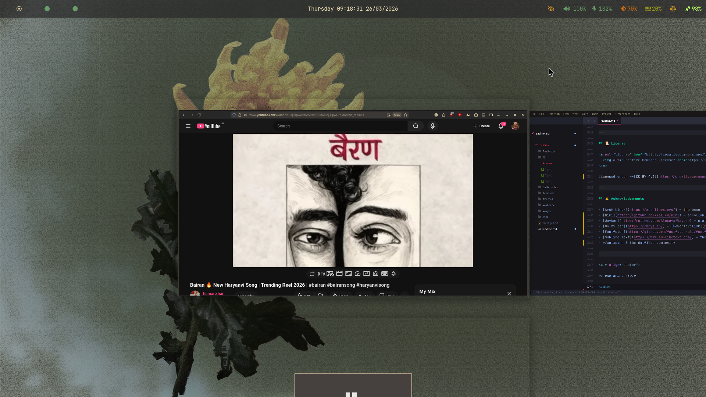

<div align="center">

# ✦ threed2y / Dotfiles ✦

**A curated aesthetic setup for Arch Linux — Niri · Waybar · Kitty · Ghostty · Sublime Text · Custom shaders**

[](https://creativecommons.org/licenses/by/4.0/)
[](https://archlinux.org/)
[](https://github.com/YaLTeR/niri)
[](https://github.com/Alexays/Waybar)

</div>

---

## 📸 Preview

> Screenshots are located in the [`Preview/`](./Preview) folder.

 
  
  

---

## 📂 Repository Structure

```
Dotfiles/
├── Fastfetch/          # Fastfetch configuration preset
├── Niri/               # Niri Wayland compositor (config.kdl)
├── Waybar/             # Status bar (config.jsonc + style.css)
├── Terminals/
│   ├── kitty/          # Kitty config + color themes
│   │   └── colors/     # Catppuccin · Gruvbox · TokyoNight · Everforest · Neon
│   ├── Ghostty/        # Ghostty config + GLSL shader collection
│   │   └── shaders/    # snow · fireworks · matrix · spotlight · starfield…
│   └── Foot/           # Foot terminal config
├── Sublime-Text/       # Preferences, keymaps, LSP-pyright settings
├── Themes/             # COSMIC .ron themes + Cosmictron icon pack
├── Wallpaper/          # Wallpaper collection
├── zshr/zsh            # .zshrc (Oh My Zsh · Powerlevel10k · plugins)
└── Packages.txt        # Full pacman/AUR package list
```

---

## 🧰 What's Inside

| Component | Details |
|-----------|---------|
| **OS** | Arch Linux (rolling) |
| **Compositor** | [Niri](https://github.com/YaLTeR/niri) — scrollable-tiling Wayland |
| **Status Bar** | [Waybar](https://github.com/Alexays/Waybar) |
| **Shell** | Zsh · Oh My Zsh · Powerlevel10k |
| **Terminals** | Kitty · Ghostty (custom GLSL shaders) · Foot |
| **Fetch** | Fastfetch with custom preset · nerdfetch |
| **Editor** | Sublime Text 4 (LSP + Pyright) |
| **Themes** | Kanagawa Theme · Cosmictron icon pack |
| **Greeter** | Greetd + TUIgreet |
---

## 🚀 Full Setup Guide

> **Already on Arch?** Skip to [Step 5 — Clone This Repo](#step-5--clone-this-repo).

---

### Step 1 — Install Arch Linux

```bash
archinstall
```

Recommended choices:
- **Profile**: Minimal (no DE)
- **Filesystem**: ext4 or btrfs
- **Bootloader**: systemd-boot or GRUB
- **Extra packages**: `git base-devel`

---

### Step 2 — Post-install: Update & Base Tools

```bash
sudo pacman -Syu
sudo pacman -S --needed base-devel git curl wget
```

---

### Step 3 — Install an AUR Helper (yay)

```bash
git clone https://aur.archlinux.org/yay-bin.git
cd yay-bin && makepkg -si && cd .. && rm -rf yay-bin
```

---

### Step 4 — Install Core Wayland Stack

```bash
sudo pacman -S --needed \
  wayland xorg-xwayland \
  seatd dbus \
  pipewire wireplumber pipewire-pulse pipewire-alsa \
  networkmanager

sudo systemctl enable NetworkManager seatd
```

---

### Step 5 — Clone This Repo

```bash
git clone https://github.com/threed2y/Dotfiles.git ~/Dotfiles
cd ~/Dotfiles
```

---

### Step 6 — Run the Install Script

```bash
bash ~/Dotfiles/install.sh
```

This places all config files and backs up any existing ones with `.bak`. Or follow the manual steps below.

---

### Step 7 — Install Niri (Wayland Compositor)

```bash
sudo pacman -S niri       # available in extra since late 2024
# or from AUR: yay -S niri
```

Apply config:

```bash
mkdir -p ~/.config/niri
cp ~/Dotfiles/Niri/config.kdl ~/.config/niri/config.kdl
```

Start from a TTY:

```bash
niri-session
```

Or use `greetd` as a display manager:

```bash
sudo pacman -S greetd greetd-agreety
sudo systemctl enable greetd
```

Edit `/etc/greetd/config.toml` and set `command = "niri-session"`.

---

### Step 8 — Install & Configure Waybar

```bash
sudo pacman -S waybar
mkdir -p ~/.config/waybar
cp ~/Dotfiles/Waybar/config.jsonc ~/.config/waybar/config
cp ~/Dotfiles/Waybar/style.css    ~/.config/waybar/style.css
```

Waybar is launched by Niri via `spawn-at-startup` in `config.kdl`. To start manually:

```bash
waybar &
```

---

### Step 9 — Configure Zsh + Oh My Zsh + Powerlevel10k

```bash
# Install Oh My Zsh
sh -c "$(curl -fsSL https://raw.githubusercontent.com/ohmyzsh/ohmyzsh/master/tools/install.sh)"

# Install Powerlevel10k
git clone --depth=1 https://github.com/romkatv/powerlevel10k.git \
  ${ZSH_CUSTOM:-$HOME/.oh-my-zsh/custom}/themes/powerlevel10k

# Install plugins
git clone https://github.com/zsh-users/zsh-autosuggestions \
  ${ZSH_CUSTOM:-~/.oh-my-zsh/custom}/plugins/zsh-autosuggestions

git clone https://github.com/zsh-users/zsh-syntax-highlighting.git \
  ${ZSH_CUSTOM:-~/.oh-my-zsh/custom}/plugins/zsh-syntax-highlighting

# Apply zshrc (backs up existing)
[ -f ~/.zshrc ] && cp ~/.zshrc ~/.zshrc.bak
cp ~/Dotfiles/zshr/zsh ~/.zshrc
source ~/.zshrc
```

> **Note:** The zshrc contains a `source ~/Downloads/VENV/LA-311/bin/activate` line — remove or replace it with your own virtualenv path, or delete it entirely.

---

### Step 10 — Install Fastfetch & Apply Config

```bash
sudo pacman -S fastfetch
mkdir -p ~/.config/fastfetch
cp ~/Dotfiles/Fastfetch/config.jsonc ~/.config/fastfetch/config.jsonc
fastfetch   # verify
```

---

### Step 11 — Install Terminals

#### Kitty

```bash
sudo pacman -S kitty
mkdir -p ~/.config/kitty
cp ~/Dotfiles/Terminals/kitty/kitty.conf  ~/.config/kitty/kitty.conf
cp ~/Dotfiles/Terminals/kitty/theme.conf  ~/.config/kitty/theme.conf
cp -r ~/Dotfiles/Terminals/kitty/colors  ~/.config/kitty/colors
```

Color themes available: `Catppuccin.conf` · `Gruvbox.conf` · `TokyoNight.conf` · `Everforest.conf` · `Neon.conf`
Switch by editing the `include` line in `~/.config/kitty/theme.conf`.

#### Ghostty (with custom GLSL shaders)

```bash
yay -S ghostty
mkdir -p ~/.config/ghostty/shaders
cp ~/Dotfiles/Terminals/Ghostty/config           ~/.config/ghostty/config
cp ~/Dotfiles/Terminals/Ghostty/shaders/*        ~/.config/ghostty/shaders/
```

To switch shaders, edit `~/.config/ghostty/config`:

```ini
custom-shader = ~/.config/ghostty/shaders/just-snow.glsl
# Options: fireworks.glsl · matrix-hallway.glsl · spotlight.glsl
#          starfield-colors.glsl · retro-terminal.glsl · cursor_warp.glsl
```

#### Foot

```bash
sudo pacman -S foot
mkdir -p ~/.config/foot
cp ~/Dotfiles/Terminals/Foot/foot.ini ~/.config/foot/foot.ini
```

---

### Step 12 — Install Sublime Text & Apply Config

```bash
yay -S sublime-text-4
mkdir -p ~/.config/sublime-text/Packages/User
cp ~/Dotfiles/Sublime-Text/* ~/.config/sublime-text/Packages/User/
```

LSP + Pyright are pre-configured. Install the `LSP` and `LSP-pyright` packages inside Sublime Text via Package Control.

---

### Step 13 — Apply Icons

```bash
mkdir -p ~/.local/share/icons
tar -xzf ~/Dotfiles/Themes/Icons/Cosmictron-Brown.tgz -C ~/.local/share/icons/
gsettings set org.gnome.desktop.interface icon-theme "Cosmictron-Brown"
# or use nwg-look for a GUI: yay -S nwg-look
```

> The `.ron` files in `Themes/` are for **COSMIC Desktop** and won't apply on a pure Niri setup.

---

### Step 14 — Set Wallpaper

```bash
mkdir -p ~/Pictures/Wallpapers
cp ~/Dotfiles/Wallpaper/* ~/Pictures/Wallpapers/

sudo pacman -S swaybg
swaybg -i ~/Pictures/Wallpapers/art-institute-of-chicago-McqDXhMeRLU-unsplash.jpg -m fill &
```

To persist, add the `swaybg` command to `spawn-at-startup` in `~/.config/niri/config.kdl`.

---

### Step 15 — Install Required Fonts

```bash
sudo pacman -S ttf-jetbrains-mono-nerd ttf-firacode-nerd
```

---

### Step 16 — Restore All Packages

```bash
# Preview first
less ~/Dotfiles/Packages.txt

# Install everything (yay handles both official + AUR)
yay -S --needed - < ~/Dotfiles/Packages.txt
```

---

### Step 17 — Final Reboot

```bash
reboot
```

---

## 🛠️ Troubleshooting

| Problem | Fix |
|---------|-----|
| Niri won't start | Run `journalctl -xe`; ensure `seatd` is running: `sudo systemctl start seatd` |
| Waybar modules missing | Install missing tools: `pamixer` (volume), `power-profiles-daemon` (battery) |
| Ghostty shader not rendering | Ensure `custom-shader-animation = always` is in Ghostty config |
| Kitty fonts look wrong | `sudo pacman -S ttf-jetbrains-mono-nerd` |
| Fastfetch wrong config path | `fastfetch --config-help` — default is `~/.config/fastfetch/config.jsonc` |
| Zsh virtualenv error on start | Remove the `source ~/Downloads/VENV/...` line from `~/.zshrc` |
| Icons not applying | Use `nwg-look` or `gsettings` to set GTK icon theme |
| `niri msg` not working | You must be inside a running Niri session |

---

## 📜 License

<a rel="license" href="https://creativecommons.org/licenses/by/4.0/">
  
</a>

Licensed under **[CC BY 4.0](https://creativecommons.org/licenses/by/4.0/)** — free to share and adapt with attribution to **threed2y**.

---

## 🙏 Acknowledgements

- [Arch Linux](https://archlinux.org/) — the base
- [Niri](https://github.com/YaLTeR/niri) — scrollable-tiling Wayland compositor
- [Waybar](https://github.com/Alexays/Waybar) — status bar
- [Oh My Zsh](https://ohmyz.sh/) + [Powerlevel10k](https://github.com/romkatv/powerlevel10k)
- [Fastfetch](https://github.com/fastfetch-cli/fastfetch) — fetch tool
- [Sublime Text](https://www.sublimetext.com/) — the editor
- r/unixporn & the dotfiles community

---

<div align="center">

*i use arch, btw.*

</div>
