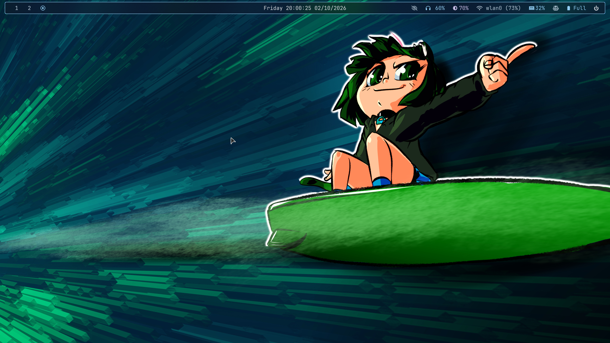
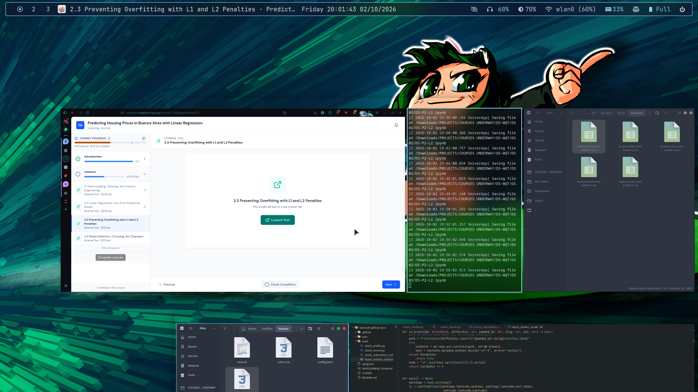
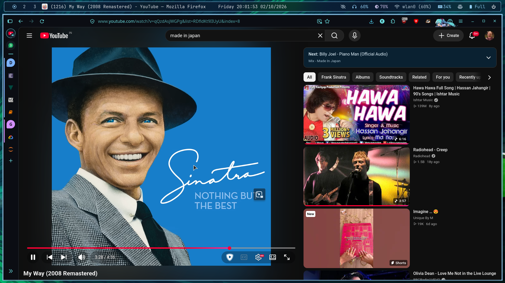
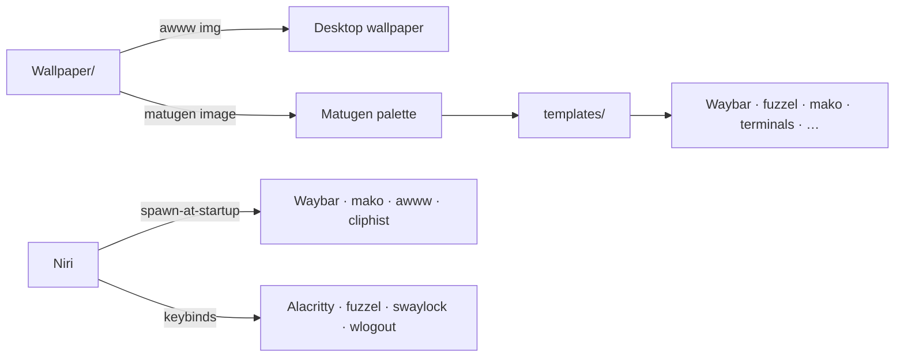

<div align="center">

# ✦ threed2y / Dotfiles ✦

### A curated, wallpaper-driven Arch Linux desktop
**Niri · Waybar · Alacritty · Lite XL · Matugen · Everforest**

[](https://creativecommons.org/licenses/by/4.0/)
[](https://archlinux.org/)
[](https://github.com/YaLTeR/niri)
[](https://github.com/Alexays/Waybar)
[](https://alacritty.org/)
[](https://lite-xl.com/)
[](https://github.com/sainnhe/everforest)

*A minimal Wayland setup that stays fast, looks cohesive, and can be rebuilt from scratch by following this file.*

</div>

---

## 📖 Table of contents

- [Preview](#-preview)
- [Highlights](#-highlights)
- [The stack](#-the-stack)
- [How it fits together](#-how-it-fits-together)
- [Repository layout](#-repository-layout)
- [Keybindings](#️-keybindings)
- [Installation](#-installation)
- [Theming workflow](#-theming-workflow)
- [Customization](#-customization)
- [Backup and updating](#-backup-and-updating)
- [Troubleshooting](#️-troubleshooting)
- [FAQ](#-faq)
- [License](#-license) · [Acknowledgements](#-acknowledgements)

---

## 📸 Preview

Screenshots live in [`Preview/`](./Preview).

| Desktop | Overview | Firefox |
| :---: | :---: | :---: |
|  |  |  |

---

## ✨ Highlights

- **Scrollable tiling** with [Niri](https://github.com/YaLTeR/niri): windows live on an infinite horizontal strip instead of a fixed grid.
- **Wallpaper-matched colors:** [`awww`](https://codeberg.org/LGFae/awww) switches wallpapers and [Matugen](https://github.com/InioX/matugen) generates a matching palette from them.
- **Everforest** as the base theme, with Kanagawa Wave available for Alacritty.
- **Alacritty** as the daily terminal, plus ready-made configs for Kitty, Ghostty (with GLSL shaders) and Foot.
- **Lite XL** as the code editor, fully reproducible from [`plugins.md`](./Code%20Editors/Lite-XL/plugins.md). A Sublime Text setup is included too.
- **Keyboard-first workflow:** launcher, clipboard history, lock screen and power menu are all one chord away.
- **One-shot restore:** `Packages.txt` lists every pacman and AUR package.

---

## 🧰 The stack

| Layer | Choice |
| --- | --- |
| **OS** | Arch Linux (rolling) |
| **Compositor** | [Niri](https://github.com/YaLTeR/niri), scrollable-tiling Wayland |
| **Status bar** | [Waybar](https://github.com/Alexays/Waybar) |
| **Launcher** | [fuzzel](https://codeberg.org/dnkl/fuzzel) |
| **Notifications** | [mako](https://github.com/emersion/mako) |
| **Clipboard** | `wl-clipboard` + [cliphist](https://github.com/sentriz/cliphist), picked through fuzzel |
| **Lock screen** | [Swaylock](https://github.com/swaywm/swaylock) |
| **Logout menu** | [wlogout](https://github.com/ArtsyMacaw/wlogout) |
| **Wallpaper** | [awww](https://codeberg.org/LGFae/awww) (animated wallpaper daemon) |
| **Color generation** | [Matugen](https://github.com/InioX/matugen) (Material You palettes from the wallpaper) |
| **Shell** | Zsh · Oh My Zsh · Powerlevel10k · autosuggestions · syntax highlighting |
| **Primary terminal** | [Alacritty](https://alacritty.org/) |
| **Other terminals** | Kitty, Ghostty (custom GLSL shaders), Foot |
| **Primary editor** | [Lite XL](https://lite-xl.com/) |
| **Secondary editor** | Sublime Text 4 (LSP, Pyright, Terminus) |
| **Browser / files** | Firefox / Nautilus |
| **System info** | Fastfetch with a custom preset |
| **Theme** | Everforest (Kanagawa Wave kept for Alacritty) |
| **Icons** | Cosmictron icon pack |
| **Greeter** | greetd + tuigreet |

---

## 🔗 How it fits together


```mermaid
flowchart LR
    W[Wallpaper/] -->|awww img| D[Desktop wallpaper]
    W -->|matugen image| M[Matugen palette]
    M --> T[templates/]
    T --> A[Waybar · fuzzel · mako · terminals · …]
    N[Niri] -->|spawn-at-startup| B[Waybar · mako · awww · cliphist]
    N -->|keybinds| L[Alacritty · fuzzel · swaylock · wlogout]
```

Niri is the root of the session: it starts the background services and owns every keybinding. Matugen sits beside it and turns whatever wallpaper you pick into colors for the rest of the desktop.

---

## 📂 Repository layout

```
Dotfiles/
├── Code Editors/
│   ├── Lite-XL/          # init.lua + plugins.md (step-by-step plugin setup)
│   └── Sublime-Text/     # Preferences, keymap, LSP-pyright, Package Control,
│                         # Terminus (in-editor terminal) settings
├── Fastfetch/            # Fastfetch preset
├── fuzzel/               # App launcher config
├── mako/                 # Notification daemon (config)
├── Matugen/              # config.toml + templates/ (wallpaper-based theming)
├── Niri/                 # Compositor config (config.kdl)
├── Preview/              # Screenshots used in this README
├── Scripts/              # Helper scripts
├── Swaylock/             # Lock screen config
├── Terminals/
│   ├── Alacritty/        # alacritty.toml + kanagawa_wave.toml
│   ├── kitty/            # kitty.conf, theme.conf
│   │   └── colors/       # Catppuccin · Gruvbox · TokyoNight · Everforest · Neon
│   ├── Ghostty/          # Ghostty config
│   │   └── shaders/      # GLSL shaders: snow, fireworks, matrix, spotlight, starfield…
│   └── Foot/             # foot.ini
├── Themes/               # COSMIC .ron themes + Cosmictron icon pack
├── Wallpaper/            # Wallpaper collection
├── Waybar/               # config.jsonc + style.css
├── Wlogout/              # Logout/power menu layout and style
├── zshr/                 # Zsh config (copy `zsh` to ~/.zshrc)
└── Packages.txt          # Pacman + AUR package list
```

---

## ⌨️ Keybindings

`Mod` is the **Super** key. These are the application binds defined in [`Niri/config.kdl`](./Niri/config.kdl); window and workspace movement keeps Niri's defaults.

| Keys | Action |
| --- | --- |
| `Mod` + `Shift` + `/` | Show the hotkey overlay (list of important binds) |
| `Mod` + `Return` | Open a terminal (**Alacritty**) |
| `Alt` + `Space` | Application launcher (**fuzzel**) |
| `Mod` + `B` | Browser (**Firefox**) |
| `Mod` + `F` | File manager (**Nautilus**) |
| `Mod` + `V` | Clipboard history (cliphist → fuzzel → `wl-copy`) |
| `Mod` + `Alt` + `L` | Lock the screen (**swaylock**) |
| `Mod` + `Alt` + `Space` | Logout / power menu (**wlogout**) |

> Press `Mod + Shift + /` any time on a running session to see the full list straight from Niri.

For clipboard history to work, a `wl-paste --watch cliphist store` entry must be running at startup. Check that it's present in `spawn-at-startup`.

---

## 🚀 Installation

> **Already on Arch with a working user, network and AUR helper?** Jump to [Step 4](#4-clone-the-repo).

### 1. Install Arch

```bash
archinstall
```

Suggested choices: **Minimal** profile (no desktop environment), ext4 or btrfs, systemd-boot or GRUB, and `git base-devel` as extra packages.

### 2. Update and install base tools

```bash
sudo pacman -Syu
sudo pacman -S --needed base-devel git curl wget
```

### 3. Install an AUR helper and the Wayland base

```bash
git clone https://aur.archlinux.org/yay-bin.git
cd yay-bin && makepkg -si && cd .. && rm -rf yay-bin

sudo pacman -S --needed \
  wayland xorg-xwayland seatd dbus \
  pipewire wireplumber pipewire-pulse pipewire-alsa \
  networkmanager

sudo systemctl enable NetworkManager seatd
```

### 4. Clone the repo

```bash
git clone https://github.com/threed2y/Dotfiles.git ~/Dotfiles
cd ~/Dotfiles
```

### 5. Install packages

Read the list first, then install everything (yay handles repos and the AUR):

```bash
less ~/Dotfiles/Packages.txt
yay -S --needed - < ~/Dotfiles/Packages.txt
```

If you'd rather install only the essentials:

```bash
yay -S --needed \
  niri waybar alacritty fuzzel mako swaylock wlogout \
  awww matugen cliphist wl-clipboard \
  fastfetch zsh lite-xl firefox nautilus \
  greetd greetd-tuigreet nwg-look \
  ttf-jetbrains-mono-nerd ttf-firacode-nerd \
  pamixer power-profiles-daemon
```

### 6. Copy the configs

Back up anything you already have first (see [Backup and updating](#-backup-and-updating)). The repo uses capitalized folder names, while apps expect lowercase ones under `~/.config`, so each command renames on copy.

```bash
mkdir -p ~/.config

# Compositor and desktop shell
cp -r ~/Dotfiles/Niri      ~/.config/niri
cp -r ~/Dotfiles/Waybar    ~/.config/waybar
cp -r ~/Dotfiles/fuzzel    ~/.config/fuzzel
cp -r ~/Dotfiles/Swaylock  ~/.config/swaylock
cp -r ~/Dotfiles/Wlogout   ~/.config/wlogout
cp -r ~/Dotfiles/Fastfetch ~/.config/fastfetch

mkdir -p ~/.config/mako
cp ~/Dotfiles/mako/config ~/.config/mako/config

mkdir -p ~/.config/matugen
cp -r ~/Dotfiles/Matugen/config.toml ~/Dotfiles/Matugen/templates ~/.config/matugen/
```

> If a file inside a folder doesn't match the name an app expects (for example Waybar reads `config` or `config.jsonc`), rename it.

**Alacritty (primary terminal)**

```bash
mkdir -p ~/.config/alacritty
cp ~/Dotfiles/Terminals/Alacritty/*.toml ~/.config/alacritty/
```

**Other terminals (optional)**

```bash
# Kitty
mkdir -p ~/.config/kitty
cp -r ~/Dotfiles/Terminals/kitty/* ~/.config/kitty/

# Ghostty (+ shaders)
mkdir -p ~/.config/ghostty
cp -r ~/Dotfiles/Terminals/Ghostty/* ~/.config/ghostty/

# Foot
mkdir -p ~/.config/foot
cp ~/Dotfiles/Terminals/Foot/foot.ini ~/.config/foot/
```

**Zsh**

```bash
sh -c "$(curl -fsSL https://raw.githubusercontent.com/ohmyzsh/ohmyzsh/master/tools/install.sh)"

git clone --depth=1 https://github.com/romkatv/powerlevel10k.git \
  ${ZSH_CUSTOM:-$HOME/.oh-my-zsh/custom}/themes/powerlevel10k
git clone https://github.com/zsh-users/zsh-autosuggestions \
  ${ZSH_CUSTOM:-$HOME/.oh-my-zsh/custom}/plugins/zsh-autosuggestions
git clone https://github.com/zsh-users/zsh-syntax-highlighting.git \
  ${ZSH_CUSTOM:-$HOME/.oh-my-zsh/custom}/plugins/zsh-syntax-highlighting

[ -f ~/.zshrc ] && cp ~/.zshrc ~/.zshrc.bak
cp ~/Dotfiles/zshr/zsh ~/.zshrc
chsh -s "$(which zsh)"
```

> ⚠️ The bundled `.zshrc` sources a personal virtualenv (`~/Downloads/VENV/LA-311/bin/activate`). Delete that line or point it at your own environment.

**Lite XL (primary editor)**

```bash
sudo pacman -S lite-xl
mkdir -p ~/.config/lite-xl
cp "$HOME/Dotfiles/Code Editors/Lite-XL/init.lua" ~/.config/lite-xl/init.lua
```

Then follow [`plugins.md`](./Code%20Editors/Lite-XL/plugins.md) to install the plugins and finish the setup.

**Sublime Text (optional)**

```bash
yay -S sublime-text-4
mkdir -p ~/.config/sublime-text/Packages/User
cp -r "$HOME/Dotfiles/Code Editors/Sublime-Text/"* ~/.config/sublime-text/Packages/User/
```

Install `LSP`, `LSP-pyright` and `Terminus` from Package Control.

**Scripts**

Helper scripts live in [`Scripts/`](./Scripts). Review them, make them executable, and put them on your `PATH`:

```bash
mkdir -p ~/.local/bin
cp ~/Dotfiles/Scripts/* ~/.local/bin/
chmod +x ~/.local/bin/*
```

### 7. Wallpapers, icons and fonts

```bash
mkdir -p ~/Pictures/Wallpapers
cp ~/Dotfiles/Wallpaper/* ~/Pictures/Wallpapers/

mkdir -p ~/.local/share/icons
tar -xzf ~/Dotfiles/Themes/Icons/Cosmictron-Brown.tgz -C ~/.local/share/icons/
gsettings set org.gnome.desktop.interface icon-theme "Cosmictron-Brown"
```

Prefer a GUI for GTK settings? Use `nwg-look`.

> The `.ron` files in `Themes/` are **COSMIC Desktop** themes and have no effect on a pure Niri session.

### 8. Start the session

From a TTY:

```bash
niri-session
```

Or through greetd + tuigreet:

```bash
sudo pacman -S greetd greetd-tuigreet
sudo systemctl enable greetd
# /etc/greetd/config.toml → command = "tuigreet --cmd niri-session"
```

Waybar, mako and the other helpers are launched from `spawn-at-startup` entries in `Niri/config.kdl`.

### 9. Post-install checklist

- [ ] `Mod + Shift + /` opens the hotkey overlay
- [ ] `Mod + Return` opens Alacritty with the Everforest look
- [ ] `Alt + Space` opens fuzzel
- [ ] Copy something, then `Mod + V` shows clipboard history
- [ ] `Mod + Alt + L` locks the screen, `Mod + Alt + Space` opens wlogout
- [ ] Waybar is visible and its modules (volume, network, battery) work
- [ ] A notification appears: `notify-send "hello" "mako works"`
- [ ] `fastfetch` prints with the custom preset

---

## 🎨 Theming workflow

Everything is built around one idea: **change the wallpaper, the desktop follows.**

1. **Set the wallpaper** with `awww`:
   ```bash
   awww-daemon &                                   # start once per session
   awww img ~/Pictures/Wallpapers/<image>.jpg      # switch wallpaper
   ```
2. **Generate colors** with Matugen from the same image:
   ```bash
   matugen image ~/Pictures/Wallpapers/<image>.jpg
   ```
3. Matugen renders everything under `~/.config/matugen/templates/` using the rules in `config.toml`, writing colors for the apps you've templated.
4. Reload the apps that don't pick up changes live (Waybar, mako, terminals).

Command names and flags can change between releases of `awww` and `matugen`. If one fails, check `awww --help` / `matugen --help`.

> Everforest is the base look. Matugen-driven colors layer on top where templated.

---

## 🔧 Customization

**Alacritty colors.** `alacritty.toml` imports a color file; `kanagawa_wave.toml` is included as an alternate palette. Swap the imported file to change schemes.

**Kitty colors.** Pick a scheme from `Terminals/kitty/colors/` (Catppuccin, Gruvbox, TokyoNight, Everforest, Neon) by editing the `include` line in `~/.config/kitty/theme.conf`.

**Ghostty shaders.** Edit `~/.config/ghostty/config`:

```ini
custom-shader = ~/.config/ghostty/shaders/just-snow.glsl
custom-shader-animation = always
# Others: fireworks · matrix-hallway · spotlight · starfield-colors
#         retro-terminal · cursor_warp
```

**Keybindings.** Add or change binds in `~/.config/niri/config.kdl`. A new app bind follows this pattern:

```kdl
Mod+T hotkey-overlay-title="Open a Terminal" { spawn "alacritty"; }
```

---

## 💾 Backup and updating

Back up before overwriting:

```bash
mkdir -p ~/config-backup
cp -r ~/.config/{niri,waybar,fuzzel,mako,swaylock,wlogout,matugen,fastfetch,alacritty,lite-xl} \
  ~/config-backup/ 2>/dev/null
[ -f ~/.zshrc ] && cp ~/.zshrc ~/config-backup/.zshrc
```

Pull in new changes later:

```bash
cd ~/Dotfiles && git pull
# then re-copy the configs you want to update (Step 6)
```

Regenerate the package list from your own machine if you fork this repo:

```bash
pacman -Qqe > ~/Dotfiles/Packages.txt
```

---

## 🛠️ Troubleshooting

| Problem | Fix |
| --- | --- |
| Niri won't start | Check `journalctl -xe`; make sure `seatd` is running: `sudo systemctl start seatd` |
| Black screen after login | Start with `niri-session` (not bare `niri`) and validate the config with `niri validate` |
| Waybar modules missing | Install the helpers they call, e.g. `pamixer` (volume), `power-profiles-daemon` (power) |
| `Mod + V` shows nothing | Make sure `wl-paste --watch cliphist store` runs at startup; copy something, then retry |
| Wallpaper doesn't change | Make sure `awww-daemon` is running before `awww img` |
| Colors don't update after a wallpaper change | Re-run Matugen, then reload Waybar/mako/terminals |
| Glyphs or icons look broken | Install a Nerd Font: `sudo pacman -S ttf-jetbrains-mono-nerd` |
| Ghostty shader not animating | Confirm `custom-shader-animation = always` is set |
| Fastfetch ignores the config | Run `fastfetch --config-help`; default path is `~/.config/fastfetch/config.jsonc` |
| Zsh errors on startup | Remove the personal `source ~/Downloads/VENV/...` line from `~/.zshrc` |
| Icons not applying | Set the theme with `gsettings` or `nwg-look` |
| `niri msg` fails | It only works inside a running Niri session |

---

## ❓ FAQ

**Can I use this on a distro other than Arch?**
The configs are portable, but `Packages.txt` and the install steps assume pacman and the AUR.

**Why Niri instead of Hyprland or Sway?**
Niri's scrollable layout means opening a window never resizes the others, and its config is a single readable KDL file.

**Do I need all four terminals?**
No. Alacritty is the primary one. Kitty, Ghostty and Foot are extras you can skip.

**Do I need both editors?**
No. Lite XL is the daily driver; Sublime Text is optional.

**Is the COSMIC theme folder required?**
No. Those files only apply to COSMIC Desktop.

---

## 📜 License

Licensed under [CC BY 4.0](https://creativecommons.org/licenses/by/4.0/). You're free to share and adapt this work with attribution to **threed2y**.

## 🙏 Acknowledgements

[Arch Linux](https://archlinux.org/) · [Niri](https://github.com/YaLTeR/niri) · [Waybar](https://github.com/Alexays/Waybar) · [Alacritty](https://alacritty.org/) · [Lite XL](https://lite-xl.com/) · [Matugen](https://github.com/InioX/matugen) · [awww](https://codeberg.org/LGFae/awww) · [Everforest](https://github.com/sainnhe/everforest) · [Oh My Zsh](https://ohmyz.sh/) · [Powerlevel10k](https://github.com/romkatv/powerlevel10k) · [Fastfetch](https://github.com/fastfetch-cli/fastfetch) · r/unixporn and the wider dotfiles community

<div align="center">

*i use arch, btw.*

</div>
